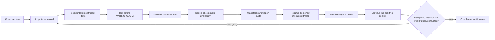

<p align="center">
  <a href="./README.en.md">English</a> |
  <a href="./README.md">中文</a>
</p>

# Codex Auto Runner

[](#requirements)
[](#safety-boundaries)
[](package.json)

> When the Codex 5-hour quota window recovers, automatically continue whatever task was left unfinished — goal sessions and plain sessions without a goal alike. Preserve the original thread context and keep moving until the weekly quota is exhausted, the task is complete, or human judgment is required.

Codex Auto Runner is a local recovery runner for Codex goal sessions. It is built for a very specific moment: a long Codex task is still clear, the thread context is still valuable, the goal is still active, but the 5-hour quota window has been exhausted.

It does not bypass limits. It prevents recovered quota from sitting idle.

Just work in Codex as usual. Codex Auto Runner detects the session, records the task state, waits for quota recovery, verifies that quota is actually available, then resumes the same Codex thread so the model continues from its existing context.

If the session has goal mode enabled, the runner also restores a quota-paused goal back to active. If it has no goal, the runner simply relies on the thread's own history — the work still does not lose its place.

In practice, it turns Codex's 5-hour recovery windows into an automatic relay: quota returns, the task continues; quota is exhausted, the runner waits; quota returns again, the original goal moves forward again. The cycle continues until the weekly quota has been fully used, the task is complete, or the system reaches a point that needs a person.

Codex Auto Runner is an unofficial local companion for Codex. It is not an OpenAI product and does not modify, bypass, or expand account limits. It simply helps you use the quota you already have with less idle time and more continuity.

## Is This for You?

Use it if:

- You often ask Codex to perform multi-hour migrations, repairs, reviews, or generation tasks.
- You want the same thread to continue when quota recovers, regardless of whether that session has goal mode enabled.
- You want a local-only runner that stops when login, quota, approvals, validation, or human judgment is required.

Do not use it if:

- You want to bypass, expand, or modify Codex account limits.
- You expect the runner to accept high-risk approvals, push code, or deploy automatically.
- You are not using Windows Codex Desktop.

If this solves your long-running Codex workflow, please star the repository so other heavy Codex users can find it.

## Vision

Codex is powerful because it can hold context, follow a goal, and reason across many steps. The costly part of quota exhaustion is not waiting. The costly part is when the next window opens and nobody is there to continue the work.

Codex Auto Runner gives long-running Codex work a cross-window continuation loop:

1. Codex is working on a task.
2. The 5-hour quota window is exhausted.
3. The local daemon records the thread, the task state, and **which thread was interrupted by quota, and when**.
4. At the recovery time, the runner reads the real quota state again instead of blindly starting.
5. If quota is confirmed available, waiting tasks are woken and the **most recently interrupted thread** is resumed first.
6. If the session's goal was paused or limited by quota pressure, it is restored to active. Sessions without a goal skip this step.
7. The runner sends the smallest necessary continuation instruction, carrying the original goal, a resume instruction, and the acceptance criteria:

```text
You are resuming a previously interrupted task via Codex Auto Runner.
This is a continuation of the same session thread; your previous context is intact.

Review what you were doing in this session and continue from where you stopped.
Do not start over, do not open a new topic, do not re-ask for information you already have.
```

8. Codex reads the original context and keeps going.
9. The cycle repeats until the weekly quota is exhausted, the task completes, or human input is required.

The core promise is simple: no blank new session, no lost context, no silent recovery window.

## Use Cases

- Large code migrations, cross-module refactors, and difficult bug investigations.
- Product features that require multiple Codex turns to implement properly.
- Overnight or unattended work where quota may recover while you are away.
- Goal-mode sessions where the intended direction is already clear.
- Sessions without goal mode that you still want to continue automatically when quota recovers.
- Treating the 5-hour and weekly quota windows as schedulable resources instead of manual timers.

## Capabilities

- **5-hour quota recovery monitoring**: reads the real Codex quota buckets and schedules wakeups from the real reset time.
- **Weekly quota drive mode**: keeps a task moving across multiple 5-hour recoveries until the weekly quota is exhausted.
- **Session discovery and goal detection**: discovers Codex sessions and flags which ones have goal mode enabled. **Sessions without a goal can still be resumed**, relying on the thread's own history.
- **Quota-interrupt tracking**: records when each thread was last interrupted by the 5-hour or weekly quota. Interrupted threads are badged in the session list and selected first, so you do not have to hunt for them.
- **Newest-interruption priority**: when several threads were interrupted by quota at once, the **most recently interrupted one** is resumed first. An explicitly set task priority still wins.
- **Active-goal restoration**: restores paused, limited, or quota-stopped goals back to active before continuing.
- **Same-thread resume**: resumes the original Codex thread so the model can continue from the existing context.
- **Reset-credit continuation**: when enabled by the user, can continue after weekly exhaustion if reset credits are available.
- **Auto and Pro task creation**: Auto mode attaches to a Codex session with one click; Pro mode exposes priority, sandbox, approval, and validation settings.
- **Quota overview**: shows the 5-hour and 1-week windows, remaining quota, refresh time, and task state.
- **Local web UI**: Vite + React interface with Chinese and English language switching.
- **Local daemon**: scheduler, HTTP API, SQLite state, and task queue all run on the user's machine.

## Runtime Loop



The scheduler does not run just because a timestamp arrived. At the recovery point, it reads quota again and performs a jittered second verification. It only starts the task when quota has moved from exhausted to available or near limit. Waking a task also clears its stale `nextRunAt`, so an outdated timestamp cannot hold it back.

## Project Structure

```text
codex-auto-runner/
  apps/
    daemon/               local daemon, quota watcher, scheduler, HTTP API
    web/                  Vite + React frontend
    cli/                  car command-line tool
  packages/
    app-server-client/    Codex app-server JSON-RPC client
    codex-resolver/       discovers and stages the Codex executable
    quota-engine/         quota bucket parsing and recovery-time logic
    persistence/          SQLite tasks, events, locks, and state machine
    task-engine/          thread resume/start, goal activation, turn lifecycle
    validator/            validation command runner
    git-guard/            repository safety checks before task execution
    logger/               structured logging and sensitive-field redaction
    shared-types/         shared configuration and domain types
  schemas/
    generated/            Codex app-server protocol schemas
  tools/
    protocol-probe/       account and quota protocol probe
    thread-turn-probe/    thread and turn protocol probe
```

## Requirements

- Windows with Codex Desktop.
- Node.js 20 or newer.
- pnpm 9 or newer (optional — see the no-pnpm equivalent commands below).
- A Codex account with available quota.

The current implementation is focused on Windows Codex Desktop. Other platforms can be added later, but Windows is the main verified target.

## Quick Start

```bash
pnpm install
pnpm doctor
pnpm --filter @car/daemon start
pnpm web
```

Open the local frontend:

```text
http://127.0.0.1:5173/
```

<details>
<summary>No pnpm installed? Run the entry points with node directly</summary>

All core logic is driven by node; pnpm is only a convenience layer for package management and task orchestration. Without pnpm, call the underlying entry points directly:

```bash
# Installing dependencies still needs a package manager; skip if already installed

# Start the daemon
node node_modules/tsx/dist/cli.mjs apps/daemon/src/index.ts

# Start the frontend (in a second terminal)
cd apps/web && node node_modules/vite/bin/vite.js
```

Note: **start the daemon before the frontend.** The frontend reads the `api.json` written by the daemon to obtain the port and auth token.

</details>

`pnpm doctor` automatically finds Codex on the current machine and verifies that the executable can run. It does not write real local paths into the repository and does not read or upload account credentials.

For the full workflow, troubleshooting steps, and FAQ, see **[USAGE.html](USAGE.html)** (Chinese).

### Codex Discovery Order

Users do not need to edit the code to bind their own Codex path. At runtime, Codex Auto Runner resolves Codex in this order:

1. `CAR_CODEX_EXEC`: an explicit executable path provided by the user.
2. `%LOCALAPPDATA%\CodexAutoRunner\codex-portable\codex.exe`: an already staged local copy.
3. `codex` from `PATH`.
4. Windows Codex Desktop: discovered through `Get-AppxPackage -Name OpenAI.Codex`, then copied into `%LOCALAPPDATA%\CodexAutoRunner\codex-portable\`.

The GitHub repository does not store a real `%USERPROFILE%` path or bind to the author's Codex installation. Each user resolves Codex locally on first run.

## Useful Commands

```bash
pnpm car status
pnpm car quota
pnpm car task list
pnpm car task run-now <task-id>
pnpm car task pause <task-id>
pnpm car task resume <task-id>
pnpm schema:gen
pnpm probe
pnpm probe:turn
pnpm doctor
pnpm privacy:check
pnpm typecheck
pnpm test
```

## Safety Boundaries

- The daemon listens only on `127.0.0.1`.
- The local HTTP API uses a generated token.
- `.env`, logs, databases, build output, probe dumps, and local runtime data are ignored by Git.
- `api.json`, `car-api.token`, `runner.db`, `status.json`, and `events.jsonl` are generated only on the user's machine and excluded by `.gitignore`.
- Codex executable paths are resolved only at runtime; logs and diagnostics redact `%LOCALAPPDATA%`, `%USERPROFILE%`, and similar local path prefixes.
- Logs redact token, authorization, secret, and account identifier fields.
- The runner does not automatically push, deploy, or accept high-risk approvals for the user.
- Codex network access must be explicitly enabled and is off by default.
- If quota is unknown, login is required, the project is locked, validation fails, or the task needs human judgment, automatic execution stops.

Before publishing changes, run:

```bash
pnpm privacy:check
```

This command scans repository files and fails if it finds real user paths, Codex private session paths, common API keys, GitHub tokens, Bearer tokens, or tracked local runtime files.

## Development Checks

```bash
pnpm --filter @car/web build
pnpm --filter @car/daemon typecheck
pnpm test
```

## Contributing

Useful contributions include:

- Codex discovery support for more platforms.
- More robust quota bucket parsing and reset-time handling.
- Clearer safety boundaries, log redaction, and privacy checks.
- UI usability, accessibility, and Chinese/English copy improvements.
- Reproducible bug reports from real long-running task workflows.

Before opening a pull request, run:

```bash
pnpm privacy:check
pnpm typecheck
pnpm test
```

See [CONTRIBUTING.md](CONTRIBUTING.md) for details.

## Current Status

The core local loop is implemented:

- Codex app-server connection and quota reading.
- 5-hour and 1-week quota bucket parsing.
- Quota recovery scheduling with second verification.
- Codex session discovery and goal-mode detection.
- **Goal-less session resume**: threads without a goal can be taken over and continued across quota windows too.
- **Quota-interrupt tracking and priority**: records the interrupted thread and time; when several overlap, the newest one is resumed first.
- Same-thread resume and active-goal restoration.
- Auto task creation and Pro task configuration.
- Local quota dashboard with Chinese and English UI.
- Reset-credit continuation option after weekly exhaustion.

Codex Auto Runner has one clear goal: when Codex is ready to continue, the task should not still be waiting for someone to return and press the button.
