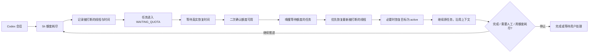

<p align="center">
  <a href="./README.en.md">English</a> |
  <a href="./README.md">中文</a>
</p>

# Codex Auto Runner

[](#环境要求)
[](#安全边界)
[](package.json)

> 当 Codex 的 5h 限额恢复时，自动接着推进没跑完的任务——支持目标会话，也支持没有设置目标的普通会话；在不浪费任何一个恢复窗口的前提下，持续推进，直至任务完成、需要人工介入，或周额度被充分消耗。

Codex Auto Runner 是一个运行在本地的 Codex 目标任务恢复器。它为一个非常具体、也非常真实的痛点而生：长任务跑到一半，5h 额度耗尽；上下文还在，目标还在，任务还没结束，但下一次额度恢复时，人不一定守在电脑前。

它要解决的不是“如何绕过限制”，而是“如何不浪费已经恢复的额度”。

你只需要在 Codex 里正常干活。Codex Auto Runner 会识别当前会话、记录任务状态、等待额度恢复、二次确认额度确实可用，然后恢复同一个 Codex 线程，让 Codex 继续沿着原上下文往前推进。

如果这个会话开启了目标模式，它会顺带把因额度而暂停的目标恢复为 active；如果没有开启目标模式，它直接依靠线程自身的历史上下文继续，同样不会丢失进度。

换句话说，它把 Codex 的 5h 恢复窗口变成了一次次自动接力：额度恢复，任务继续；再次耗尽，再次等待；直到周额度被用到极致，或者目标真正抵达终点。

这是一个非官方的本地工具，不属于 OpenAI 官方产品，也不会突破、规避或修改任何额度规则。它只是让你已经拥有的额度更有秩序、更少空转、更接近连续生产力。

## 立即判断是否适合你

适合：

- 你经常让 Codex 做跨小时的迁移、修复、审查或生成任务。
- 你希望恢复窗口到来时自动续跑同一个线程，无论这个会话有没有开启目标模式。
- 你接受工具只在本机运行，并且遇到登录、额度未知、审批或验证失败时停止。

不适合：

- 你想绕过、扩容或修改 Codex 额度规则。
- 你希望工具自动接受高风险权限、自动 push 或自动部署。
- 你不使用 Windows Codex Desktop。

如果这个项目正好解决你的长任务续跑痛点，欢迎给仓库点 star，让其他 Codex 重度用户更容易发现它。

## 核心愿景

Codex 的强大之处在于上下文、目标和持续推理。真正昂贵的不是等待本身，而是等待之后没人接住任务。

Codex Auto Runner 让长任务拥有“跨额度窗口继续推进”的能力：

1. Codex 正在执行一个任务。
2. 5h 额度耗尽，任务进入等待。
3. 本地守护进程记录当前线程、任务状态，以及**哪个线程被额度打断、在什么时候**。
4. 到达恢复时间后，系统重新读取真实额度，而不是盲目启动。
5. 额度确认可用后，唤醒等待额度的任务，优先恢复**最新被打断的那个线程**。
6. 如果这个会话的目标因为额度限制暂停，自动恢复为 active；没有目标则跳过这一步。
7. 向 Codex 发送最小必要的继续指令（含原目标、恢复指令与验收标准）：

```text
你正在被 Codex Auto Runner 恢复执行一个之前中断的任务。
这是同一个会话线程的延续，你之前的历史上下文都还在。

请先回顾本会话中你上一次正在做的事，从中断的地方继续推进。
不要重头开始，不要开启新话题，不要重复询问已经得到过的信息。
```

8. Codex 读取原上下文继续推进。
9. 循环往复，直到周额度耗尽、任务完成，或遇到需要用户判断的情况。

这就是它的中心承诺：不新开空会话，不丢失上下文，不让恢复后的 5h 窗口沉默过去。

## 适合什么场景

- 大型代码迁移、跨模块重构、复杂 Bug 排查。
- 需要 Codex 连续多轮推进的产品功能实现。
- 晚上、工作间隙、离开电脑后仍希望任务在额度恢复时自动继续。
- 目标模式已经设置清楚，希望 Codex 按原目标持续执行。
- 会话没有开启目标模式，但你依然希望它能在额度恢复时自动接着跑。
- 希望把 5h 窗口和周额度当成可调度资源，而不是手动盯守的倒计时。

## 主要能力

- **5h 限额恢复监测**：读取 Codex 真实额度桶，按真实 reset 时间安排唤醒。
- **周额度持续推进**：支持“直到周额度耗尽”模式，让任务跨多个 5h 窗口继续运行。
- **会话发现与目标识别**：自动发现 Codex 会话并标注哪些已开启目标模式；**未设置目标的会话同样可以续跑**，直接沿用线程历史上下文。
- **限额打断识别**：记录每个线程最近一次被 5h / 周额度打断的时间。被中断的线程在会话列表里带角标，并会被优先选中，无需手动翻找。
- **优先续跑最新**：同时存在多条被限额中断的线程时，优先续跑**最新被打断的那条**。显式设置的优先级仍然优先。
- **自动恢复 active 目标**：目标因暂停、受限或额度耗尽停住时，可在恢复运行前重新设为 active。
- **原线程续跑**：恢复同一个 Codex thread，让模型读取原上下文继续，而不是新开一个空会话。
- **充值/重置额度续跑**：用户开启后，可在周额度耗尽且有可用重置次数时继续任务。
- **自动版 + 专业版**：自动版面向一键接管会话；专业版保留优先级、沙箱、审批、验证命令等高级配置。
- **额度概览**：展示 5h 与 1 周窗口、剩余额度、刷新时间、任务状态。
- **本地 Web UI**：Vite + React 前端，提供中英文切换与接近 Codex 风格的界面。
- **本地守护进程**：调度器、HTTP API、SQLite 状态、任务队列都运行在本机。

## 运行闭环



调度器不会只因为时间到了就贸然执行。它会在恢复点重新读取额度，并经过抖动后的二次验证，确认额度确实从 exhausted 变为 available 或 near_limit 后才启动任务。任务被唤醒时会一并清除旧的 `nextRunAt`，避免被过期时间戳挡住。

## 项目结构

```text
codex-auto-runner/
  apps/
    daemon/               本地守护进程、额度监测、调度器、HTTP API
    web/                  Vite + React 前端
    cli/                  car 命令行工具
  packages/
    app-server-client/    Codex app-server JSON-RPC 客户端
    codex-resolver/       自动探测并暂存 Codex 可执行文件
    quota-engine/         额度桶解析、阻塞判定、恢复时间计算
    persistence/          SQLite 任务、事件、锁与状态机
    task-engine/          thread resume/start、目标激活、turn 生命周期
    validator/            验证命令执行器
    git-guard/            任务运行前的仓库安全检查
    logger/               结构化日志与敏感字段脱敏
    shared-types/         共享配置与领域类型
  schemas/
    generated/            Codex app-server 协议 schema
  tools/
    protocol-probe/       账号与额度协议探针
    thread-turn-probe/    线程与回合协议探针
```

## 环境要求

- Windows + Codex Desktop。
- Node.js 20 或更高版本。
- pnpm 9 或更高版本（可选，见「快速开始」的无 pnpm 等价命令）。
- 可用的 Codex 账号额度。

当前实现优先面向 Windows Codex Desktop 环境。其他平台后续可以扩展，但不是当前主要验证目标。

## 快速开始

```bash
pnpm install
pnpm doctor
pnpm --filter @car/daemon start
pnpm web
```

打开本地前端：

```text
http://127.0.0.1:5173/
```

<details>
<summary>没有安装 pnpm？用 node 直接跑（等价命令）</summary>

核心逻辑全部由 node 驱动，pnpm 只是包管理与任务编排的便利层。若本机没有 pnpm，可直接调用底层入口：

```bash
# 安装依赖仍需包管理器；若已安装过依赖，可跳过

# 启动 daemon
node node_modules/tsx/dist/cli.mjs apps/daemon/src/index.ts

# 启动前端（另开一个窗口）
cd apps/web && node node_modules/vite/bin/vite.js
```

注意：**必须先启动 daemon，再启动前端**。前端在启动时读取 daemon 写下的 `api.json` 来获取端口与鉴权 token。

</details>

`pnpm doctor` 会在当前机器上自动查找 Codex，并确认可执行文件可以运行。它不会把真实本机路径写入仓库，也不会读取或上传用户的账号凭据。

更完整的操作流程、排障方法与常见问题，见 **[USAGE.html](USAGE.html)**。

### Codex 自动发现顺序

下载者不需要改代码绑定自己的 Codex 路径。运行时会按以下顺序解析 Codex：

1. `CAR_CODEX_EXEC`：用户显式指定的 codex 可执行文件。
2. `%LOCALAPPDATA%\CodexAutoRunner\codex-portable\codex.exe`：本机已经暂存过的副本。
3. `PATH` 中的 `codex`。
4. Windows Codex Desktop：通过 `Get-AppxPackage -Name OpenAI.Codex` 免提权发现 MSIX 安装位置，并把运行所需文件复制到用户本机的 `%LOCALAPPDATA%\CodexAutoRunner\codex-portable\`。

因此，GitHub 仓库里不会保存某一台电脑的 `%USERPROFILE%` 真实路径，也不会绑定作者机器上的 Codex 安装目录。每个用户首次运行时都会在自己的机器上重新解析。

## 常用命令

```bash
pnpm car status
pnpm car quota
pnpm car task list
pnpm car task run-now <task-id>
pnpm car task pause <task-id>
pnpm car task resume <task-id>
pnpm schema:gen
pnpm probe
pnpm probe:turn
pnpm doctor
pnpm privacy:check
pnpm typecheck
pnpm test
```

## 安全边界

- daemon 只监听 `127.0.0.1`。
- 本地 HTTP API 使用随机 token 鉴权。
- `.env`、日志、数据库、构建产物、探针转储、本机运行数据不会进入 Git。
- `api.json`、`car-api.token`、`runner.db`、`status.json`、`events.jsonl` 等运行文件只在用户本机生成，并已被 `.gitignore` 排除。
- Codex 可执行路径只在运行时解析；日志和诊断输出会把 `%LOCALAPPDATA%`、`%USERPROFILE%` 等本机路径脱敏。
- 日志会脱敏 token、authorization、secret、account_id 等字段。
- 不自动 push、不自动部署、不替用户接受高风险审批。
- Codex 网络访问需要显式开启，默认关闭。
- 当额度未知、需要登录、项目被锁定、验证失败或任务需要人工判断时，调度器会停止自动推进。

发布前可以运行：

```bash
pnpm privacy:check
```

该命令会扫描仓库文件，发现真实用户路径、Codex 私有会话路径、常见 API Key、GitHub token、Bearer token 或本地运行文件名时直接失败，避免把个人信息误提交到公开仓库。

## 开发检查

```bash
pnpm --filter @car/web build
pnpm --filter @car/daemon typecheck
pnpm test
```

## 参与贡献

适合贡献的方向：

- 新平台的 Codex 发现逻辑。
- 更稳健的额度桶解析和恢复时间判断。
- 更清楚的安全边界、日志脱敏和隐私检查。
- UI 可用性、可访问性和中英文文案。
- 可复现的 bug 报告和真实长任务使用反馈。

提交前请运行：

```bash
pnpm privacy:check
pnpm typecheck
pnpm test
```

更多说明见 [CONTRIBUTING.md](CONTRIBUTING.md)。

## 当前状态

项目已经具备核心闭环：

- Codex app-server 连接与额度读取。
- 5h 与 1 周额度桶解析。
- 额度恢复点调度与二次验证。
- Codex 会话发现与目标模式检测。
- **无目标会话续跑**：未设置 goal 的线程同样可以被接管并跨额度窗口继续。
- **限额打断识别与优先续跑**：记录被打断的线程与时间，多条并存时优先续跑最新的一条。
- 原线程续跑与目标 active 恢复。
- 自动版任务创建与专业版任务配置。
- 本地额度仪表盘与中英文界面。
- 周额度耗尽后的重置次数续跑选项。

Codex Auto Runner 的目标很明确：当 Codex 可以继续时，任务不应该还在等待人回来按下按钮。
